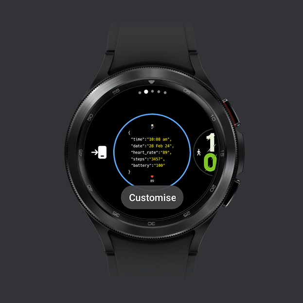
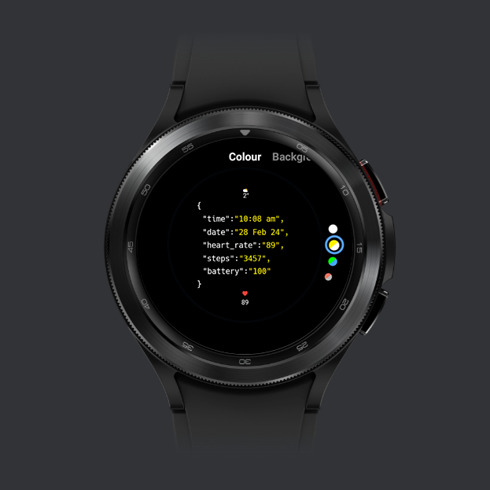
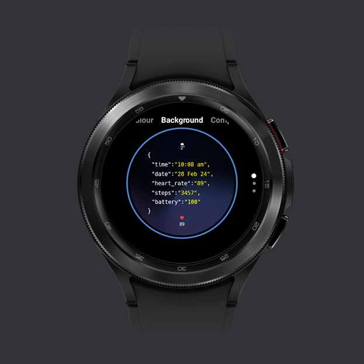
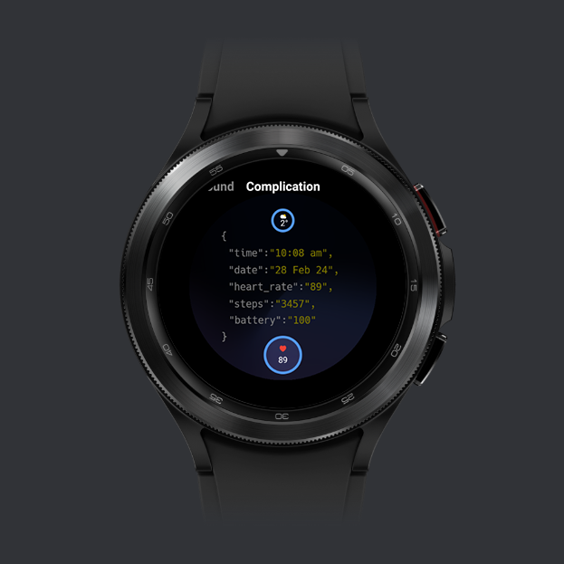
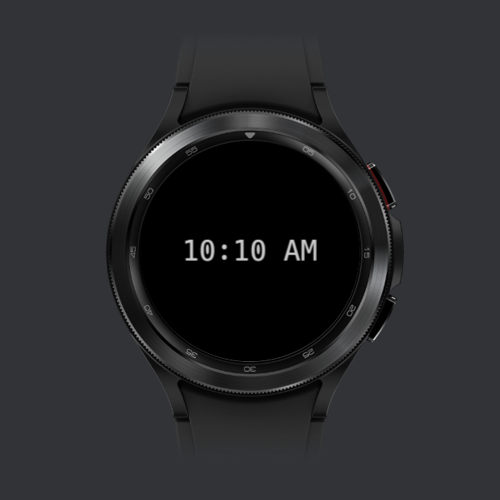

## JSON Formatted Watch Face

&nbsp;
<div id="image-container">
  
    &nbsp;
   
  &nbsp;
  
  &nbsp;
  
  &nbsp;
  
  &nbsp;
  
</div>
&nbsp;
&nbsp;

## How to install 

1) Enable developer options on your WearOS device.
2) Enable USB Debugging and Wireless debugging.
3) Both PC and Watch should be on same Wi-Fi network.
4) Pair device using ```adb pair <IP of device>``` then enter pairing code when prompted for secure TCP/IP communication.
5) ```adb pair``` is used for wifi pairing your device with Android >= 11, while ```adb connect``` can be used to connect directly to a device with Android <11 over wifi.
6) **Install** the app using ```adb install <path to .apk file>``` 
